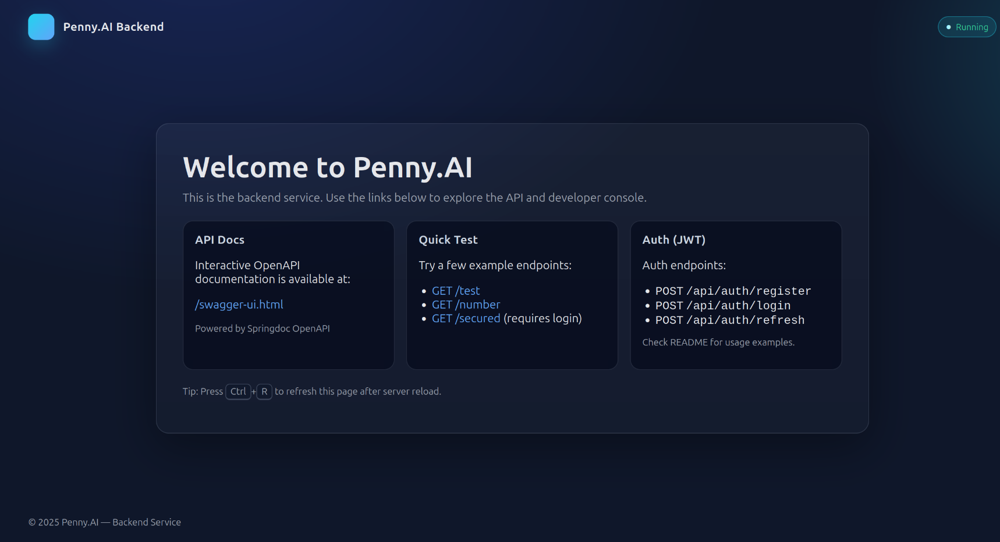

# # Penny.AI — Financial Buddy Backend

A production-ready Spring Boot backend for Penny.AI, your AI-powered financial buddy. It ships with JWT authentication, user management, OpenAPI docs, an H2 persistent database (file mode), CORS, request logging, and a foundation for AI features via LangChain4j.




## Highlights
- Modern Spring Boot 3 (Java 17)
- Secure JWT-based authentication (access + refresh token scaffolding)
- Spring Security with BCrypt password hashing
- RESTful APIs with OpenAPI/Swagger UI
- Persistent H2 database (file mode) via Spring Data JPA
- Bean Validation (@Valid) on request DTOs
- CORS enabled for easy frontend integration
- Request/response logging filter for local debugging
- Devtools for hot reload
- LangChain4j dependency included to power AI features


## Architecture (at a glance)
- Controllers
  - JwtAuthController — register, login, refresh, logout
  - ExampleController — basic test/utility endpoints
- Security
  - SecurityConfig — HTTP security, public/secure routes, form login handler
  - JwtTokenFilter — parses Bearer tokens and sets authentication
  - CorsConfig — permissive CORS for local dev
  - LoggingFilter — logs request/response (size-limited preview)
- Domain
  - UserEntity, UserRepository, UserService
- Utilities
  - JwtUtil — token generation/validation (HS256)


## Tech Stack and Key Dependencies
- Spring Boot Starters
  - spring-boot-starter-web
  - spring-boot-starter-security
  - spring-boot-starter-data-jpa
  - spring-boot-starter-validation
- Database
  - H2 (runtime) — file-based persistence under ./data/database
- Auth
  - io.jsonwebtoken: jjwt-api, jjwt-impl, jjwt-jackson (HS256)
- API Documentation
  - springdoc-openapi-starter-webmvc-ui
- Developer Experience
  - spring-boot-devtools
  - Lombok (provided)
- AI
  - dev.langchain4j:langchain4j

See pom.xml for exact versions.


## Quickstart
Prerequisites: Java 17+, Maven wrapper (included), internet access for dependencies.

1) Install dependencies and run tests
```bash
./mvnw clean install
```

2) Run the app (live reload via devtools)
```bash
./mvnw spring-boot:run
```

3) Or build a jar and run
```bash
./mvnw clean package
java -jar target/pennyai-0.0.1-SNAPSHOT.jar
```

Default server port: 9090


## API Documentation
- Swagger UI: http://localhost:9090/swagger-ui.html
- OpenAPI JSON: http://localhost:9090/v3/api-docs


## Authentication Flow
- Register a user
  - POST /api/auth/register
  - Body: JSON with username, password, etc. (see RegisterRequestDTO)
- Login to obtain tokens
  - POST /api/auth/login?username=alice&password=secret
  - Returns: { accessToken, refreshToken } when successful
- Use Bearer token on secured endpoints
  - Example: GET /secured with Authorization: Bearer <accessToken>
- Refresh token
  - POST /api/auth/refresh?refreshToken=<token>

Example requests (curl):
```bash
# Register
curl -X POST http://localhost:9090/api/auth/register \
  -H 'Content-Type: application/json' \
  -d '{"username":"alice","password":"secret123","email":"alice@example.com"}'

# Login
curl -X POST 'http://localhost:9090/api/auth/login?username=alice&password=secret123'

# Call a secured endpoint
ACCESS=eyJ... # paste accessToken
curl -H "Authorization: Bearer $ACCESS" http://localhost:9090/secured

# Refresh (scaffold)
REFRESH=eyJ... # paste refreshToken
curl -X POST "http://localhost:9090/api/auth/refresh?refreshToken=$REFRESH"
```


## Useful Endpoints (dev)
- GET / — landing page with a link to Swagger UI
- GET /test — echoes optional body or returns a test string
- POST /test — echoes JSON body
- GET /number — returns a random number
- GET /secured — requires valid JWT access token
- H2 Console — http://localhost:9090/h2-console
  - JDBC URL: jdbc:h2:file:./data/database
  - Username: sa
  - Password: (empty by default)


## Configuration
Configure via application.properties or environment variables.
- Server
  - server.port=9090
- Logging (examples enabled by default)
  - logging.level.org.springframework.web=DEBUG
- JWT
  - jwt.secret=your_32+_bytes_secret
  - jwt.expiration=36000008  # ms
- Database (H2 file mode)
  - spring.datasource.url=jdbc:h2:file:./data/database;DB_CLOSE_DELAY=-1;DB_CLOSE_ON_EXIT=FALSE
  - spring.datasource.username=sa
  - spring.datasource.password=
  - spring.jpa.hibernate.ddl-auto=update

Environment override examples:
```bash
SERVER_PORT=8080 \
JWT_SECRET='change_me_to_a_long_random_secret' \
JWT_EXPIRATION=3600000 \
./mvnw spring-boot:run
```


## Development
- Java version: 17
- Hot reload: spring-boot-devtools is enabled
- Request logging: see LoggingFilter output in console for method, URL, params, body, and response status
- CORS: wide-open for local development (adjust allowed origins in CorsConfig for production)

Run dependency tree:
```bash
./mvnw dependency:tree
```

Run tests:
```bash
./mvnw test
```


## Security Notes
- Replace jwt.secret with a strong, randomly generated value (>= 32 bytes). Do not commit real secrets.
- For production, restrict CORS origins, disable devtools, and consider a real database (PostgreSQL/MySQL) with proper credentials.
- Consider rotating refresh tokens and storing token metadata if building full session management.


## Roadmap Ideas
- Full refresh token endpoint with rotation/blacklist
- User roles/permissions and admin endpoints
- Rate limiting and IP throttling
- Migrate to Postgres profile; Flyway for migrations
- Integrate LangChain4j for financial advisory prompts and tool usage


## License
Specify your license here (e.g., MIT). Update pom.xml <licenses> accordingly.